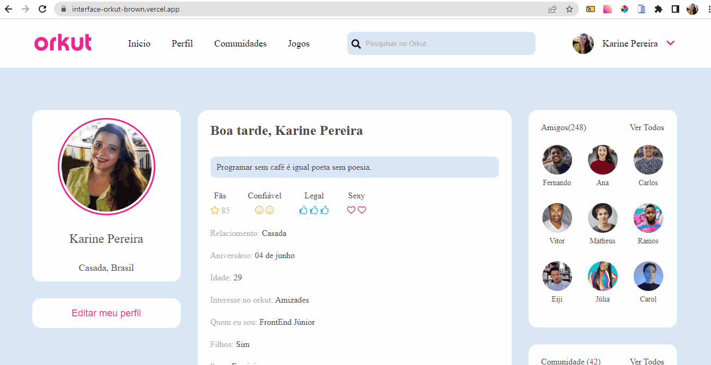

# 🖥️ Projeto Perfil do Orkut

## ⌨ Descrição
Projeto realizado com o objetivo de clonar a tela de perfil do orkut e também criar uma página de login, utilizando as hardskills apresentadas abaixo.

## ✍️ Processo
- Marcação semântica HTML5
- Propriedades personalizadas de CSS3
- Flexbox  
- Design responsivo
    

## 💡 Inspiração Figma

>Figma: <a href="https://www.figma.com/file/Yb9IBH56g7T1hdIyZ3BMNO/Desafios---Codel%C3%A2ndia?node-id=173746%3A3595&t=q8FS2CcBsMxVC631-0">Desafio Codilândia

## 🖱️ A página
    

> Acesse a página online: <a target= "_blank">https://interface-orkut-brown.vercel.app/</a>

## 👩‍💻 Dev's
<table align="center">
  <tr>
    <td align="center">
      

         
          <b> Karine Pereira </b> 
            
            
      

    </td>

  <td align="center">
      

         
          <b> Helena Siena </b> 
            
            
      

    </td>

  </tr>
</table>